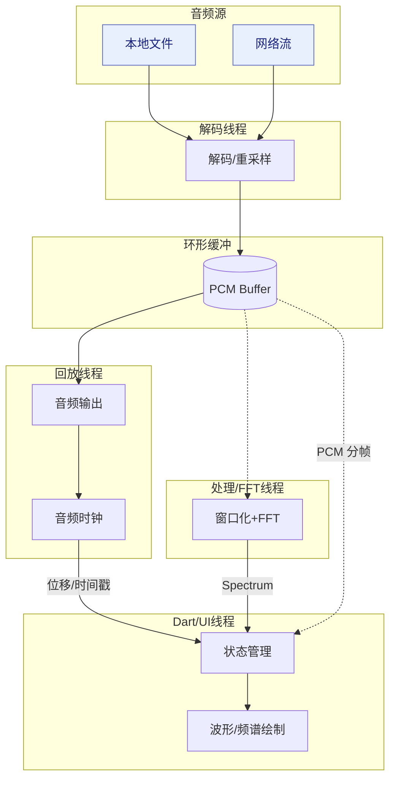

# SoundWave 概要设计

基于 PRD 的技术方案概要，覆盖架构分层、关键模块、数据流/线程模型、接口定义和性能策略，为后续详细设计和实现提供骨架。

## 1. 架构分层
- Flutter UI 层：负责 UI 渲染、交互、状态管理（推荐 Riverpod/BLoC），自定义波形/频谱绘制组件。
- Flutter 插件层：Platform Channel 统一接口，负责参数校验、错误映射、线程切换；调用平台侧 C/C++ 核心。
- 原生桥接层（iOS/Android）：少量平台适配（文件/网络权限、音频设备配置、AudioSession/AudioFocus），桥接 C/C++ 核心暴露的 API。
- C/C++ 音频核心：跨平台共用代码基线。负责解码（FFmpeg/平台解码器封装）、重采样、环形缓冲、时钟、FFT/DSP、数据分发。

## 2. 关键模块
- `AudioEngine`（C/C++）：驱动解码与回放，管理音频设备、时钟同步、环形缓冲。
- `Decoder`：封装 FFmpeg（默认）/平台解码器，统一输出 PCM（float32/16bit 可配置）。
- `Resampler`：采样率转化与通道布局统一（立体声/单声道）。
- `RingBuffer`：无锁/轻锁实现，支撑回放线程与处理线程的数据交换。
- `DSP/FFT`：窗口化（Hann/Hamming），FFT（KissFFT/vDSP/Android FFT），计算功率谱/能量。
- `DataDispatcher`：按节流策略推送 PCM 分帧和谱数据到 Dart（避免 UI 过载）。
- `UI Renderer`（Flutter）：`WaveformView`、`SpectrumView` 自定义绘制；数据抽稀与缓存。
- `Controller`（Flutter）：播放/暂停/seek、URL 加载、本地文件选择，管理 `AudioState`。

## 3. 数据流与线程模型
- 解码线程：读取源 → 解码 → 重采样 → 写环形缓冲。
- 回放线程（低延迟优先）：从环形缓冲取 PCM → 音频输出 → 驱动时钟。
- 处理线程（可与回放合并或独立）：对分帧数据做 FFT/能量计算 → 推送谱数据。
- Dart 主线程：接收节流后的 PCM/谱 → 状态更新 → 自定义绘制。
- 通信：Platform Channel 使用异步回调；音频数据用批量帧推送（减少频繁跨界调用）。

## 4. 接口概要
- Dart → 原生（MethodChannel）
  - `init(config)`：采样率、缓冲大小、通道数、节流参数。
  - `load(source)`：本地路径或 URL（附可选 headers）。
  - `play()` / `pause()` / `stop()` / `seek(ms)`.
  - `setVisualization(config)`：FFT 窗口、重叠度、帧大小、数据推送频率。
- 原生 → Dart（EventChannel/回调）
  - `onState(event)`：准备、缓冲、播放、结束、错误。
  - `onPcmFrame(float[] samples, meta)`：PCM 分帧（标注采样率、通道数、顺序）。
  - `onSpectrum(float[] spectrum, meta)`：频谱数据（窗口大小、bin 宽度、时间戳）。

## 5. 平台适配要点
- iOS：AudioSession 配置（播放/混音）、后台播放权限、vDSP 加速 FFT（可选）。
- Android：AudioFocus、MediaCodec 备选解码、AAudio/OpenSL ES 选择、权限（网络/文件）。
- 文件访问：SAF/文件选择器；网络需支持 HTTPS，弱网超时与重试策略配置。

## 6. 性能与节流策略
- UI 节流：波形/谱推送频率上限（如 30-60 fps），抽稀采样点数；批量传输减少 Channel 开销。
- 内存：复用缓冲，避免大对象频繁分配；环形缓冲容量可配置。
- 同步：以音频时钟为准，UI 同步误差目标 < 50 ms。
- 回调负载：回放线程避免重计算，FFT 在独立线程或批量处理。

## 7. 错误与恢复
- 错误分类：网络超时/断网、解码失败、不支持格式、权限缺失、音频设备被占用。
- 恢复：弱网重试、前后台切换自动恢复播放与可视化；错误上报到 Dart 侧展示可读提示。

## 8. 配置与可扩展性
- 可配置：采样率、缓冲时长、PCM 帧大小、FFT 窗口与重叠度、推送频率、通道模式。
- 扩展挂点：录音输入通路、通道分离显示、导出截图、标注/书签、主题皮肤。

## 9. 测试策略（概要）
- 单测：FFT/DSP 结果正确性、缓冲读写、节流逻辑、数据格式转换。
- 集成测试：本地/流式播放、播放控制、Seek 后同步、前后台切换恢复。
- 性能测试：延迟/帧率/CPU/GPU/内存，长时间播放（2h）稳定性，弱网/丢包模拟。

## 10. 架构与数据流图

### 10.1 分层与模块交互
```mermaid
flowchart LR
    UI(Flutter UI\nWaveform/Spectrum\nController/State) -->|MethodChannel| Plugin(Flutter Plugin\n参数校验/错误映射)
    Plugin --> Bridge(原生桥接层\n(iOS/Android)\n权限/设备配置)
    Bridge --> Core(C/C++ 音频核心\n解码/重采样/缓冲/DSP/FFT)
    Core --> Bridge
    Bridge -->|EventChannel| UI
```

### 10.2 数据流与线程模型

