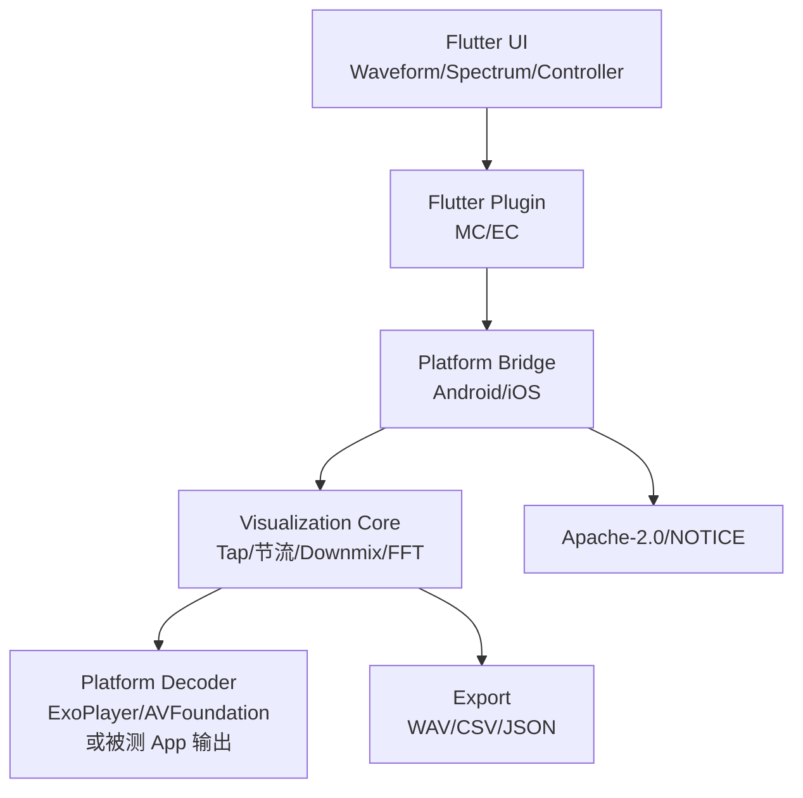
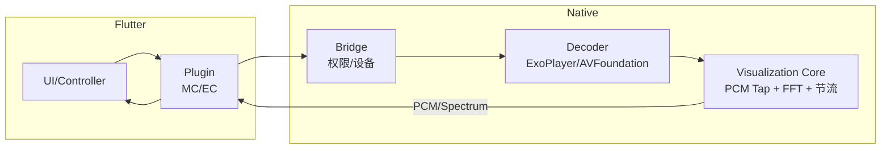
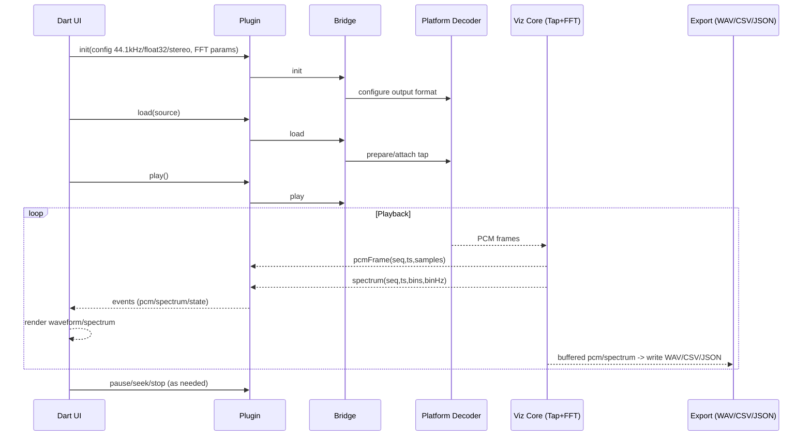

# SoundWave 0.0.2 设计文档

## 1. 范围与背景
- 基于 `TECH_PLAN_0.0.2`：移除 FFmpeg，使用平台解码器（ExoPlayer/MediaCodec、AVFoundation），FFT 方案为 Android KissFFT（JNI）、iOS vDSP（默认，KissFFT 可选），统一输出 44.1 kHz/float32/stereo。
- 可视化能力组件化：Android AAR `com.soundwave:visualization-core`，iOS Pod/SPM `SoundwaveVisualization`（XCFramework/源码），Dart 包 `soundwave_visualization`；示例仅作集成验证。
- 许可证切换为 Apache-2.0，NOTICE/DEPENDENCIES 覆盖 ExoPlayer Apache、KissFFT BSD、vDSP 专有。
- 测试工具场景：受测 App 已有解码能力，插件仅做旁路 PCM/频域采集；支持导出通用格式（WAV/CSV/JSON）供 PC 分析；移动端可视化为可选扩展/后门开关，可在播放中调出实时观察。

## 2. 总体架构
```mermaid
flowchart LR
    Source[Local/HTTP Source] -->|Platform Decode| Decoder
    Decoder -->|PCM 44.1kHz float32 stereo| Buffer[(RingBuffer)]
    Buffer -->|Throttle Frames| Tap[PCM Tap]
    Tap -->|Downmix + Window + FFT| FFT[KissFFT (Android)<br/>vDSP/KissFFT (iOS)]
    Tap -->|EventChannel| PCMStream[PCM Stream]
    FFT -->|EventChannel| FFTStream[Spectrum Stream]
    PCMStream --> UIWave[Flutter UI Waveform]
    FFTStream --> UISpec[Flutter UI Spectrum]
    UIWave -->|MethodChannel| Control[Control: init/play/pause/seek]
    UISpec -->|MethodChannel| Control
    Tap --> Export[Export WAV/CSV/JSON]
    Export --> PC[PC Analysis]
```

## 3. 分层架构


## 4. 模块职责与交互
- Decoder（平台）：解码输出 44.1kHz/float32/stereo，不足格式重采样；保持双声道。
- Visualization Core：PCM Tap、节流、Downmix、窗口化、FFT（Android KissFFT，iOS vDSP 默认/KissFFT 可选），事件封装，可挂接导出模块。
- Plugin/Bridge：参数校验、错误映射、MethodChannel 调用、EventChannel 推送。
- Dart 层：状态管理、绘制组件、配置 FFT/节流参数，订阅 PCM/Spectrum。



## 5. 业务逻辑时序


## 6. 流程图（播放+FFT）
```mermaid
flowchart TD
    A[Init 44.1kHz/float32/stereo] --> B[Load Source]
    B --> C[Play]
    C --> D[Decoder PCM Out]
    D --> E[RingBuffer]
    E --> F[PCM Tap Throttle]
    F --> G[Downmix (L+R)/2]
    G --> H[Window Hann/Hamming]
    H --> I[FFT<br/>Android KissFFT<br/>iOS vDSP 或 KissFFT]
    I --> J[Power Norm 2/(N*E_window)]
    J --> K[EventChannel Spectrum]
    F --> L[EventChannel PCM]
    K --> M[Flutter UI Spectrum]
    L --> N[Flutter UI Waveform]
    M --> O[Display/Interact]
    N --> O
    F --> P[Export WAV/CSV/JSON]
    P --> Q[PC Analysis]
```

## 7. 接口与配置要点
- 解码输出：固定 44.1kHz/float32/stereo，必要时重采样；FFT 输入前 downmix。
- FFT 默认：Hann，nfft=1024，overlap=50%，归一化 `2/(N*E_window)`，跨端容差 < 1e-3。
- iOS FFT 选择：默认 vDSP，可在 demo/配置中切换 KissFFT（与 Android 对齐）。
- 发布命名：Android `com.soundwave:visualization-core`，iOS Pod/SPM `SoundwaveVisualization`，Dart `soundwave_visualization`，版本 semver 对齐。
- 数据导出：支持 PCM → WAV（44.1kHz/float32/stereo）、谱数据 → CSV/JSON（含 binHz/seq/ts）；导出模块可独立依赖，无需引入 UI。

## 8. 测试与合规挂钩（摘要）
- 跨端谱对齐：同一测试信号（单频/双频/白噪）在 Android KissFFT 与 iOS vDSP/KissFFT 输出差异 < 1e-3。
- 长稳/前后台：≥1h 播放，PCM/FFT 序列无漂移；前后台切换不丢序号。
- 数据导出正确性：导出的 WAV/CSV/JSON 可在 PC（如 Audacity/Matlab/Python）读取且与实时事件一致。
- 合规：Apache-2.0 LICENSE，生成 NOTICE/DEPENDENCIES 覆盖 ExoPlayer Apache、KissFFT BSD、vDSP 专有，CI 校验。
