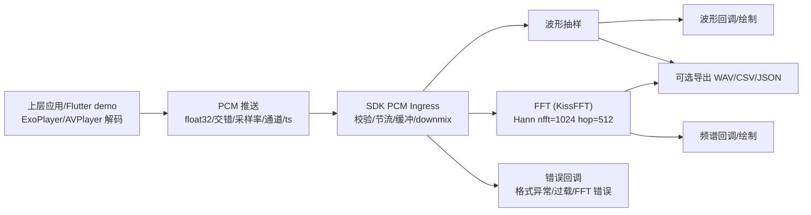
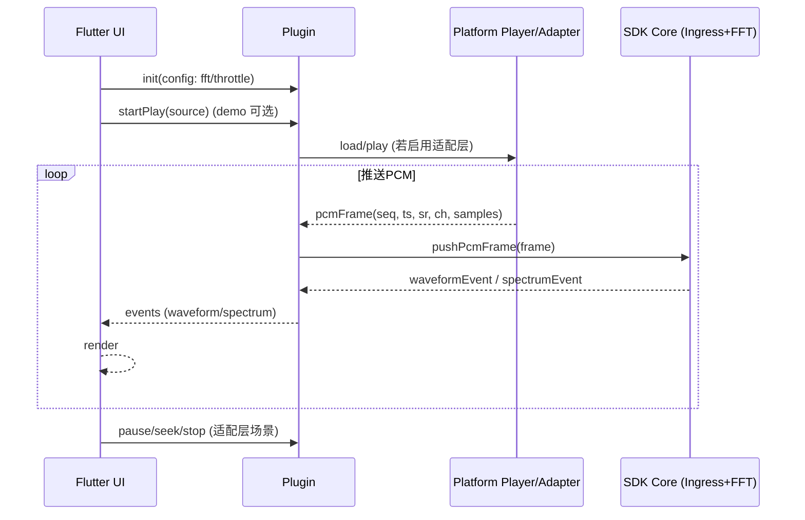

# SoundWave 0.0.2 概要设计（PCM 输入 + KissFFT + 原生库发布）

## 1. 范围与背景
- 解码职责上收：上层应用（或 demo）负责集成平台播放器（Android ExoPlayer/MediaCodec，iOS AVPlayer/AVAudioEngine），向 SDK 推送解码后的 PCM。
- SDK 聚焦 PCM → 波形抽样 → KissFFT 频谱输出，产出 AAR（Maven）与 XCFramework，Flutter demo 通过插件桥接调用。
- 许可证切换为 Apache 2.0，附第三方（KissFFT 等）LICENSE 摘录。

## 2. 总体架构

## 3. 模块职责
- PCM Ingress：接收上层 PCM 帧（float32，交错多声道，携带采样率/通道/时间戳/序号）；格式校验、帧长/采样率变化检测、节流与缓冲；Downmix `(L+R)/2`。
- FFT Engine：KissFFT（唯一实现），窗口化（默认 Hann，预留 Hamming），nfft/hop 可配置；输出幅度谱归一化 0..1，附原始幅度、binHz、时间戳/序号。
- Waveform Sampler：从 PCM 流按窗口抽稀输出波形帧，供 UI 绘制。
- Error & Event：错误码/错误信息（输入异常、缓冲过载、FFT 失败）；波形/频谱事件带 meta（采样率、窗口、binHz、序号/时间戳）。
- 可选播放适配层：封装 ExoPlayer/AVPlayer 提供 `load/play/pause/stop/seek` 便于 demo/快速集成，核心仍以 PCM 推送为准。
- Flutter 插件：MethodChannel API 映射 init/参数配置/PCM 推送/事件订阅/错误回调；向 Dart 推送波形/频谱事件；保持向后兼容。
- Demo（Flutter）：持有平台播放器解码，或复用适配层；在 `pubspec.yaml` 声明 `soundwave_player/example/assets/audio` 作为 assets；自定义绘制波形/频谱（可参考原生示例）。

## 4. 数据与接口设计
- PCM 输入帧：`{float[] samples, int sampleRate, int channels, long timestampMs, long seq, int frameSize}`；推送频率建议与 hop 对齐（如 1024/2048 帧）。
- 核心 API 示例：
  - `init(config)`：FFT 参数、节流策略、队列尺寸。
  - `pushPcmFrame(frame)`：输入 PCM，返回是否接受；异常走错误回调。
  - `setFftParams(nfft, hop, window)` / `setThrottle(rate/fps)`。
  - `subscribeWaveform(listener)` / `subscribeSpectrum(listener)` / `unsubscribe(listener)`.
  - （可选）`load/play/pause/stop/seek`：仅在启用播放器适配层时提供。
- 波形事件：`{seq, timestampMs, sampleRate, channels, samples[] (downsampled)}`。
- 频谱事件：`{seq, timestampMs, sampleRate, nfft, hop, window, binHz, magnitude[] (norm0..1), rawMagnitude[]}`。
- 错误码：`INVALID_FORMAT`、`SR_CHANNEL_MISMATCH`、`BUFFER_OVERFLOW`、`FFT_ERROR`、`PLAYER_ERROR`（仅适配层）。

## 5. 时序（demo 路径）

## 6. 构建与发布
- Android：Gradle module 产出 AAR，支持 Maven 发布；CMake 构建 KissFFT 与核心；插件与 demo 可 path 依赖源码或依赖发布版。
- iOS：XCFramework（静态/动态二合一），CMake/Xcode 构建；支持本地与二进制集成。
- 版本：与 PRD/计划一致采用 semver，同步 Android/iOS/Flutter 主次版本。
- 资产：demo 在 `pubspec.yaml` 声明 `soundwave_player/example/assets/audio`，随包打进 App。

## 7. 兼容性与性能
- 兼容：Android API 23+，iOS 8.0+；PCM 规格变化需重新 init 或动态适配。
- 性能：FFT 单独线程，复用缓冲，节流避免 UI 过载；目标渲染 60fps，可降级到 30fps。
- 长稳：1–2 小时连续播放无明显 XRuns/内存增长 <5%。

## 8. 测试要点
- 单测：FFT 频点正确性（单/双频、白噪）、窗口/nfft/hop 组合；PCM 序号/节流。
- 集成：上层推送 PCM（本地/流式解码），验证波形/频谱同步；错误回调覆盖格式异常/缓冲过载；前后台切换恢复。
- 跨端对齐：Android/iOS 同信号输出差异 <1e-3（幅度谱）。
- 产物验证：AAR/XCFramework 构建、集成可用；Flutter demo 在源码/发布模式均可跑通。
- 许可：Apache 2.0 + NOTICE/DEPENDENCIES，含 KissFFT 摘录。
